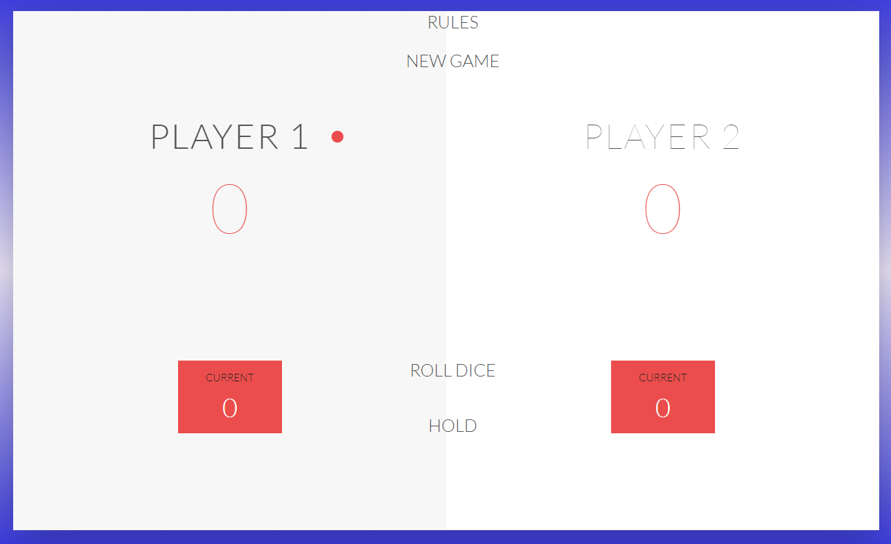

<h1 align="center">Roll-Dice Game</h1>

<h2 align="center"><a href="https://nipulsingal.github.io/Roll-Dice-Game">Play Game</a></h2>

## Game Rules -

1. The game has 2 players,playing in rounds

2. In each turn, a player rolls a dice as many times as he wishes. Each result get added to his ROUND score

3. BUT, if the player rolls a 1, all his ROUND score gets lost. After that, it's the next player's turn

4. The player can choose to 'HOLD', which means that his ROUND score gets added to his GLOBAL score. After that, it's the next player's turn

5. The first player who reaches 100 points on GLOBAL score wins the game.

Visit the link and enjoy my game.

> Copyright to NipulSingal.
